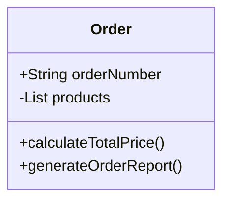
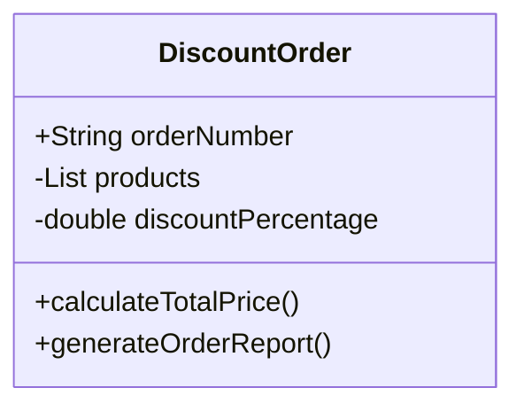

# Rule 2 - Don't Repeat Yourself


Duplication may be the root of all evil in software


---

Problems: 

1. Unreadable & Increases maintenance
2. Easy to make a mistake

<!--
1. 我们常见的重复的代码都有啥样的， 重复的常量，代码片段，方法还有类。
2. 所带来的问题往往是，1. 不是完全重复，个别细节不一样，更加难以阅读，导致维护成本更高。 2. 修改好一处，忘记修改另一处 
3. 项目中大量的重复代码，受破窗效应的影响，开发者很容易产生更多的坏代码，还觉着理所当然。


4. 产生大量重复代码的原因： 
    1. 是自身的态度问题，觉着好坏代码无所谓 - 这种情况呢，我们会严厉打击。 
    2. 自身能力问题，不知道应该如何解决这样的问题 - 那应该好好看看书，多多学习别人的好呆萌，多多请教别人。 
    3. 还有一种我们经常说的为了赶工期 - 这个也是我们认为我们写不出来好代码的一个原因，但是我并不认为赶工期和写好代码是相互冲突的，从以往的经验看，大部分情况是应该第一个和第二个原因导致，因为开发人员在第一版代码的时候就没有考虑如何写出好代码， 第二版代码又会以大改影响工期的原因来放任它的存在。
-->

---

A few ways to eliminate duplication
1. Common Method
2. Lambda
3. BeanUtils
4. Generic
5. Class
6. Design Pattern
7. AOP

---

# Common Method

Extract common behaviors into 
1. a private/public method in a class
2. a util class from multiple classes
<!--
1. 这个是很好理解的，也是大家最常用的一种方式。
    1. 对于当前类中的重复代码， 我们可以提取到一个private或者public 方法中。
    2. 对于在多个类中重复代码，如果这些重复的代码与当前对象状态无关，就应该定义在一个工具类中 - StringUtils。java
-->
---

# Lambda
Reference Link: https://fluff-clam-4e7.notion.site/Lambda-3edf4b1a7d384260a142ecab85089354
```ts
public class DataFilter {
    public List<Integer> filterNumbers(List<Integer> numbers, Predicate<Integer> predicate) {
        List<Integer> result = new ArrayList<>();
        for (Integer number : numbers) {
            if (predicate.test(number)) {
                result.add(number);
            }
        }
        return result;
    }
}
dataFilter.filterNumbers(numbers, number -> {number > 0});
dataFilter.filterNumbers(numbers, number -> {number % 2 == 0});
```

```ts
public static void processNames(List<String> names, Function<String, String> nameProcessor, String processType) {
    System.out.println(processType + " Names:");
    for (String name : names) {
        String processedName = nameProcessor.apply(name);
        System.out.println(processedName);
    }
}
processNames(names, String::toUpperCase, "Uppercase");
processNames(names, String::toLowerCase, "Lowercase");

```

<!--
1. 第一部分代码，假设需要根据不同的过滤条件来过滤数据，基本流程是一致的，但是每次过滤的条件略微不同。
2. 我们有两种选择， 一种是局部内部类，一种是lambda表达式。
3. 内部类 - java1.1 引入内部类，目的是解决两个问题。1. 隐藏内部类行为对于外部类，2. 另一个就是实现代码块的传递， 通过定义一个局部内部类，就可以实现。 但是在java1.8之后，lambda是一种更简便的方式.
4. 第二部分代码，需要遍历数组，将元素都转换为大写，或者小写。 这里有一个特别的点，我们可以直接使用既存方法的签名，不用箭头现定义一个函数。
5. 如果有小伙伴不太了解lambda，可以看下我的读书笔记啊，肯定比百度问答整理的好。
-->
---

Reducing the reading load Vs Increasing the reading load?
- Example

```ts
public void method() {
    for(***){
        if(condition1){    
            method1();
        }else if(condition2){
            method2();
        }
    }
	 
}
public void method1() {
    for(***){
        if(condition1){    
            ***
        }
    }
}
public void method2() {
    for(***){
        if(condition2){    
            ***
        }
    }
}
```

<!--
1. 但是我发现有一种不太好的实践，就是单纯为了去重而去重，去重是为了便于阅读和维护，但是，像这样，就为了少编写一些循环便利一个集合的代码，而都集中到一个common方法中，在我看来并不是一个好的实践，反而增加的阅读的负担，因为应将两件不相干的事情合并到一个方法，也无法抽象出一个好的方法名。
-->

---

# BeanUtils
VO vs DTO vs PO

```ts
org.springframework.beans.BeanUtils.copyProperties(source, target);
org.apache.commons.beanutils.BeanUtils.copyProperties(target, source);
```

<!--
1. VO， DTO， PO经常需要做一些相互的转换，就会出现很多重复的调用一些字段的set和get方法。
2. 可以使用utils工具类来完成这些操作。 有sprin 提供的和apache提供， 不同点是，source和target 参数顺序不一样
3. 还有不同点是，source<target都可以正常copy，但是如果source>target时候，apache的会报错，spring的会自动忽略缺失的字段
4. 它们都是浅拷贝，至于深拷贝，那自己写一个吧，一般都是通过输出流来复制一个对象的副本，再通过输入流将这个副本实例化出来。
-->
---

# Generic
```ts
private void getAndUpdateBalanceResultMap(String key, Map<String, List<TransferBalanceDTO>> compareResultListMap, List<TransferBalanceDTO> balanceDTOs) {
    List<TransferBalanceDTO> tempList = compareResultListMap.getOrDefault(key, new ArrayList<>());
    tempList.addAll(balanceDTOs);
    compareResultListMap.put(key, tempList);
}

private void getAndUpdateDetailResultMap(String key, Map<String, List<TransferDetailDTO>> compareResultListMap, List<TransferDetailDTO> detailDTOS) {
    List<TransferDetailDTO> tempList = compareResultListMap.getOrDefault(key, new ArrayList<>());
    tempList.addAll(detailDTOS);
    compareResultListMap.put(key, tempList);
}
```

<!--
1. 两个方法唯一的不同就是，List中类型不同， 这个时候我们应该考虑的是使用泛型， 泛型的本质就是类型的参数化。
-->

---

# Generic
Reference Link: https://fluff-clam-4e7.notion.site/3dc253d4393440bca2807824f013ad9b
```ts
private <T> void getAndUpdateResultMap(String key, Map<String, List<T>> compareResultListMap, List<T> accountingDTOS) {
    List<T> tempList = compareResultListMap.getOrDefault(key, new ArrayList<>());
    tempList.addAll(accountingDTOS);
    compareResultListMap.put(key, tempList);
}
```
<!--
1. <T> 声明这是个泛型方法， 如何只需要将List中的类型使用T进行参数化就可以了。
2. 泛型被设计出来的一个原因就是为了减少重复代码，增加可读性。使用泛型可以简单地分为三个层级
    1. 仅仅使用泛型类，不去考虑为什么这么做以及如何工作的。
    2. 在处理一些遗产泛型代码的时候或者深入了解spring框架的时候，需要对java泛型有一定的了解。
    3. 成为一名泛型程序设计者。
3. 我觉着我们大部分都是在第一和第二层级， 除非你真的需要去参与spring框架的编写，或者java语言的设计者。
-->
---
# Class





<!--
1. 再就是，我们要多多练习使用类的继承和多态来减少重复代码。
2. 这里的例子，为了方便大家快速理解，我直接以图形的方式来展示，而不是代码。
3. 一个是普通订单，一个是打折订单，唯一的不同是打折订单多了个discountPercentage字段，并且calculateTotalPrice()方法是根据这个打折百分比计算总价，那其他所有的字段和方法都是重复。
-->


