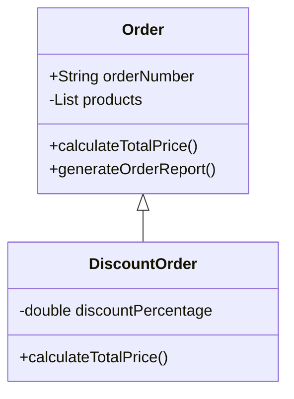
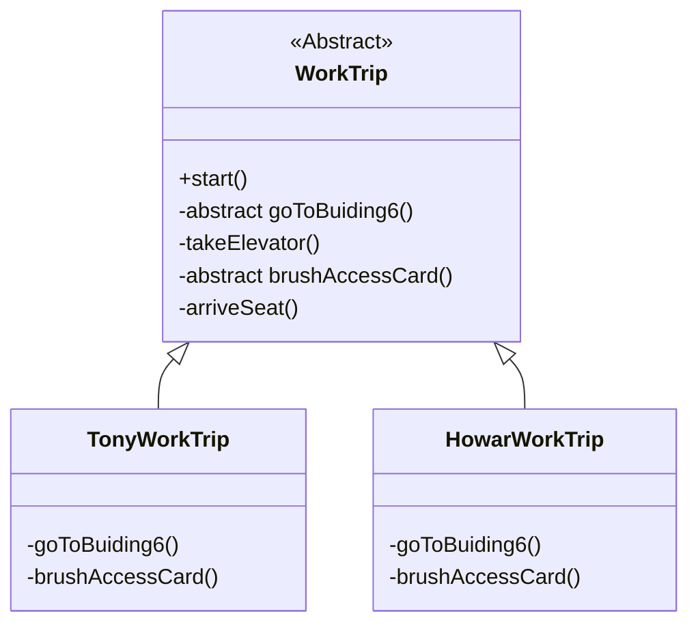

---

# Class

<!--
1. DiscountOrder 继承Order class，并且只它只需要定义discountPercentage和calculateTotalPrice 方法就可以了。
-->

---
# Design Pattern

#### Template Method

<!--
1. 关于设计模式，这里介绍两种设计模式来减少重复代码。
2. 第一种就是大家特别熟悉的模式，模板方法。 做BDI的小伙伴会非常熟悉这种方式，因为BDI代码大量的使用这种方式。
3. 举了一个通俗易懂的例子，我们每天来上班，都需要经历四步走， 到达6号楼，乘坐电梯，刷卡进门，到达座位。
4. 正常我们编写代码的时候，肯定是每个class都要重复的去定义这些方法。 但是，采用模板方法，我们将主体流程都定义在一个抽象类中，我们看到有一个public的start 方法用于启动这个流程，其他每个步骤都是私有的方法，这里goToBuiding6()和brushAccessCard()被定义成抽象方法，期望是由子类来具体实现而且是必须实现的，因为每个人到达6号楼的方法是不一样的，Tony坐车来， Howar步行来，有得人坐地铁来，他们刷门禁卡输入的密码也是不一样的， 所以这些具体的行为都应该在具体的子类中定义，这样外面只需要调用start方法就可以启动整个流程。
-->