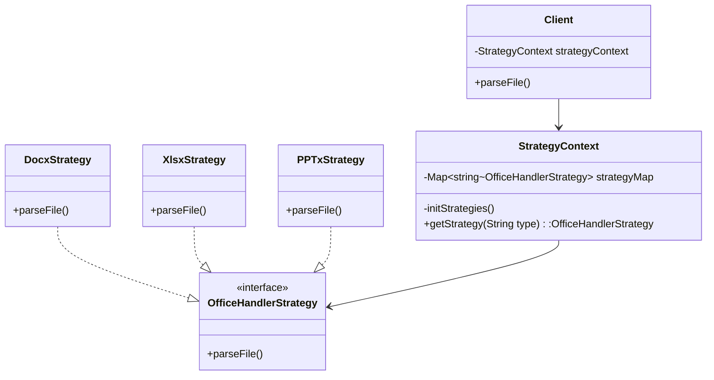

---
# Design Pattern

#### Stragety

<!--
1. 还有一种设计模式是策略模式， 当我们发现代码中有大量的重复的if-else或者swtich-case块并且里面调用的行为又都是类似的时候，应该考虑一下是否可以使用策略模式。
2. 同样还是通过图形来快速了解一下这个模式。
3. 假设我们程序需要支持解析三种不同的文件，word, excel, ppt。我们一般的写法是通过if-else还有switch来通过各种分支判断来调用相应的方法来解析问题。
4. 在图形中，总共有这几种角色， 一是三个具体策略的实现以及一个接口的定义。二是StrategyContext，它向下初始化并拥有所有的策略实现，向上向调用者提供根据type返回所需要的策略实现，它实际就是一个中介的角色。这样也就消除了Client直接拥有具体的stragey，也就消除了if-else或者switch. 三是Client，也就是调用类， 它拥有Context类，通过调用它的getStrategy()方法获取到stragety来解析文件。
5. 这样带来的好处是消除了if-else， 并且client在运行时候还可以动态的改变具体的stragety。
6. 同时Context中，这里是我们自己初始化所有的strategy，其实如果使用sprintcontext的，我们可以直接从容器中来获取就行。
6. 记得systemquery中好像就有对于策略模式的应用，但是当时发现一个finding是对context初始化时候，实在一个方法中进行，也就是每次方法的调用都要初始化一次context。
-->